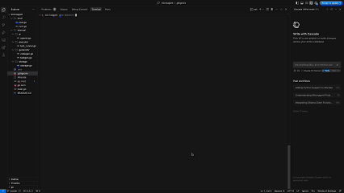

# AIterate

AIterate is an intelligent code generation tool that uses AI to iteratively create and test code implementations. It's designed to streamline the development process by automatically generating both implementation and test files, managing dependencies, and ensuring code quality through continuous testing.

## Features

- 🤖 AI-Powered Code Generation
- ✅ Automatic Test Generation
- 🔄 Iterative Refinement
- 📦 Automatic Dependency Management
- 🎯 Smart Directory Organization
- 💡 Intelligent Error Handling

## How It Works

AIterate follows a sophisticated process to generate and refine code:

1. **Initial Setup**
   - Creates a clean workspace in a temporary directory
   - Initializes a new Go module (for Go projects)
   - Sets up the project structure

2. **Test Generation Phase**
   - Analyzes your function description
   - Generates comprehensive test cases covering:
     - Normal use cases
     - Edge cases
     - Error conditions
   - Ensures proper test structure and imports

3. **Implementation Phase**
   - Generates initial code implementation based on tests
   - Includes necessary package imports
   - Implements the core functionality
   - Handles error cases

4. **Iterative Refinement**
   - Runs the test suite
   - If tests fail:
     - Analyzes test output and error messages
     - Identifies issues in both tests and implementation
     - Makes intelligent corrections
     - Repeats until tests pass or max iterations reached

5. **Dependency Management**
   - Scans code for external package imports
   - Automatically adds required dependencies
   - Updates go.mod and go.sum files
   - Runs go mod tidy to clean up dependencies

6. **Final Organization**
   - Creates a dedicated directory with a meaningful name
   - Copies successful implementation and tests
   - Ensures all files are properly formatted
   - Maintains clean project structure

## Installation

1. Clone the repository:
```bash
git clone https://github.com/prathyushnallamothu/aiterate.git
cd AIterate
```

2. Install dependencies:
```bash
go mod download
```

3. Create a `.env` file with your OpenAI API key:
```bash
OPENAI_API_KEY=your_api_key_here
```

## Usage

To generate a new function with tests:

```bash
go run main.go new
```

For example:
```bash
go run main.go new
```

The tool will guide you through the process and show progress at each step:
1. Test generation
2. Implementation creation
3. Test execution
4. Code refinement
5. Final file organization

## Project Structure

```
AIterate/
├── cmd/           # Command-line interface
├── internal/      # Internal packages
│   ├── ai/       # AI integration
│   ├── executor/ # Test execution
│   └── generator/# Code generation
├── main.go       # Entry point
└── go.mod        # Dependencies
```

## Dependencies

- github.com/fatih/color: Terminal color output
- github.com/sashabaranov/go-openai: OpenAI API integration
- github.com/spf13/cobra: CLI framework
- github.com/joho/godotenv: Environment variable management

## Contributing

Contributions are welcome! Please feel free to submit a Pull Request.


